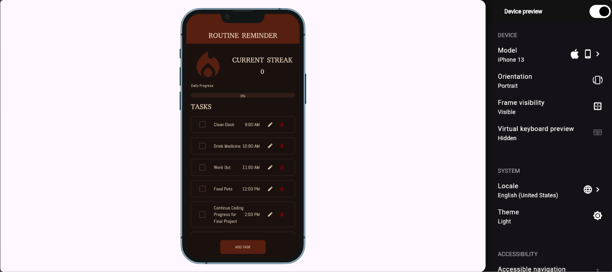

# ROUTINE REMINDER

> Routine Reminder is a habit tracking app created to help users manage daily tasks, track progress and build consistency through the streak system. 

- **Live demo:** https://ejmndoza0330.github.io/Routine-Reminder/
- **Demo video:** `docs/demo.mp4` (link it here once it exists)
- **Course:** Applications Development and Emerging Technologies (6ADET), Holy Angel University
- **Author:** Enrico T. Mendoza Jr.

---

## Screenshots


| Dashboard | Task Configuration | Success Screen |
| --- | --- | --- |
|  |  | |


## What it does

- Displays a daily dashboard with a streak counter and dynamic progress bar.

- Allows users to view a list of daily tasks with assigned times.

- **NOT YET DONE:** Add new tasks via a configuration modal.

- **NOT YET DONE:** Trigger a lazy alarm system with midnight resets and overdue tags.

## Built with
| Framework | Flutter (Dart) |
| --- | --- |
| State | `setState` (will add more) |
| Storage | (will be using shared_preferences. NOT YET IMPLEMENTED) |
| Other packages | `flutter_screenutil`, `google_fonts` |

## Running it yourself

```bash
flutter pub get
flutter run -d web-server --web-port 8080
```
Then open http://localhost:8080. Requires Flutter 3.44.8 (run `flutter --version`).

### Environment variables

This project does not require any environment variables or a `.env` file. All task and streak data is stored locally on the device using `shared_preferences`, and there are no external cloud services or APIs requiring secret keys.

## Privacy and secrets

- This app currently stores data strictly locally on the device within the app's active memory. No user data is transmitted to external servers.
- There are currently no API keys, secrets, or .env files required or exposed.
- All sample data, screenshots, and videos contain **no real personal information.**

## Project documentation

| Document | |
| --- | --- |
| [Proposal](docs/01-proposal.md) | the problem, the users, the scope |
| [Mockup and wireframes](docs/02-mockup.md) | what it looks like, and the screen flow |
| [Design system](docs/03-design-system.md) | colors, type, spacing, components |
| [Weekly reports](docs/04-weekly-reports.md) | what happened each week |
| [Demo video](docs/05-demo-video.md) | the recording and what it shows |
| [Security and privacy](docs/06-security-and-privacy.md) | the checklist, filled in |

## Status and what is next

- The core Dashboard UI is complete including Custom Progress Bar, Task List layout, and Primary Button.

**Not yet Done**
- The Task Configuration Modal (to make the "Add Task" button functional).
- Persistent state management/storage so tasks save between reloads.
- The Lazy Alarm System (DateTime logic and overdue tags). 
- The Success Screen UI. 

## Credits

- Packages: see `pubspec.yaml`
- Custom Icons: Material Icons (built-in)
  
---

## AI use (Not Finished)

If you used AI while building this, say so here. Honest disclosure is the
standard in this course and increasingly outside it, and reporting heavy use
accurately costs you nothing.

This section is the last 10 points of the finals badge, and it wants three
things:

``

- the badge above, or one you like better
- a line naming which assistant you used and how much of the work it touched
- a link to [AI-USAGE.md](AI-USAGE.md), where the full account lives

Keep the detail in `AI-USAGE.md` rather than here. This section is the summary a
visitor reads; that file is the record the badge is graded from.

---

## Licence

MIT, see [LICENSE](LICENSE).
