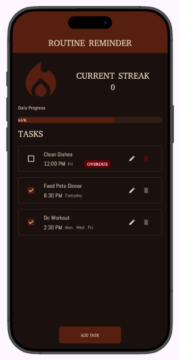
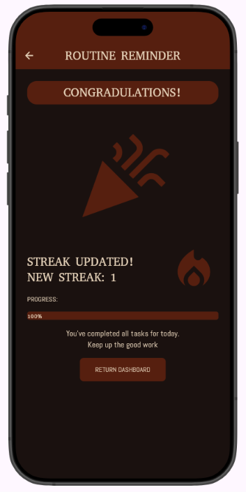

# ROUTINE REMINDER

> Routine Reminder is a habit tracking app created to help users manage daily tasks, track progress and build consistency through the streak system. 

- **Live demo:** https://ejmndoza0330.github.io/Routine-Reminder/
- **Demo video:** [`docs/demo.mp4`](docs/05-demo-video.md) 
- **Course:** Applications Development and Emerging Technologies (6ADET), Holy Angel University
- **Author:** Enrico T. Mendoza Jr.

---

## Screenshots


| Dashboard | Task Modal | Success Screen |
| --- | --- | --- |
|  | [TaskModal](docs/assets/TaskModal.png) |  |


## What it does

- Displays a daily dashboard with a streak counter and dynamic progress bar.

- Allows users to view a list of daily tasks with assigned times.

-  Add new tasks via a configuration modal.

- Trigger a lazy alarm system with midnight resets and overdue tags.

## Built with
| Framework | Flutter (Dart) |
| --- | --- |
| State | `setState`, with a `Timer.periodic` to refresh overdue tags and check for a new day |
| Storage | `shared_preferences`, through a separate `TaskStorage` class (device-local, no backend) |
| Other packages | `flutter_screenutil`, `google_fonts`, `shared_preferences`, `device_preview` |

## Running it yourself

```bash
flutter pub get
flutter run -d web-server --web-port 8080
```
Then open http://localhost:8080. Requires Flutter 3.44.8 (run `flutter --version`).

### Environment variables

This project does not require any environment variables or a `.env` file. All task and streak data is stored locally on the device using `shared_preferences`, and there are no external cloud services or APIs requiring secret keys.

## Privacy and secrets

- This app stores data locally on the device using `shared_preferences` (the browser's local storage on web). No user data is transmitted to external servers.
- There are currently no API keys, secrets, or .env files required or exposed.
- All sample data, screenshots, and videos contain **no real personal information.**

## Project documentation

| Document | |
| --- | --- |
| [Proposal](docs/01-proposal.md) | the problem, the users, the scope |
| [Mockup and wireframes](docs/02-mockup.md) | what it looks like, and the screen flow |
| [Design system](docs/03-design-system.md) | colors, type, spacing, components |
| [Weekly reports](docs/04-weekly-reports.md) | what happened each week |
| [Demo video](docs/05-demo-video.md) | the recording and what it shows |
| [Security and privacy](docs/06-security-and-privacy.md) | the checklist, filled in |

## Status and what is next
**Done**
- Dashboard with a streak counter and a progress bar linked to the task list; reaching 100% opens the Success Screen
- Add, edit and delete tasks through a modal; a task name and at least one scheduled day are required
- Tasks, streak and last-opened date persist across reloads with shared_preferences
- Lazy alarm: an OVERDUE badge appears when a task scheduled for today passes its time (refreshed every 15 seconds), and the checklist resets when the calendar day changes
- The streak counts once per day, and checkboxes lock until the next day
- The progress bar counts only tasks scheduled for today; other tasks are locked until their day
- The streak resets to 0 if a day is missed (strict: one missed day breaks it)
- The streak is saved as soon as all tasks are completed, before the success screen opens

**Known limitations and next steps**
- A day with nothing scheduled counts as a missed day, so the streak resets after a rest day
- Data lives in this browser's local storage, so clearing site data erases it and there is no sync between devices.
- The streak breaks on any day with no scheduled tasks, even though there was nothing to complete, so tasks that skip days (for example Monday and Wednesday only) reset the streak

## Credits
  
- Packages: flutter_screenutil, google_fonts, shared_preferences, device_preview (full list in `pubspec.yaml`)
- Fonts: Abyssinica SIL (headings) and Abel (body text), loaded through the google_fonts package
- Icons: Flutter's built-in Material Icons
- Design: Figma mockup made by me
  
---

## AI use


I used Google Gemini in week 1 and Claude from week 2 onward. I wrote the app's structure and design myself: the dashboard and success-screen layouts, `apptheme.dart` and `progress_bar.dart`. AI wrote `storage.dart`, which I kept because I understand it and wanted storage kept separate from the dashboard. It also fixed or heavily guided the overdue logic, the day selector, the required-days check, the overdue refresh timer and the streak and daily-reset rules. I tested each change, rejected some of it (Gemini was wrong about `CardThemeData`), and decided what to keep. Full account: [AI-USAGE.md](AI-USAGE.md).

---

## Licence

MIT, see [LICENSE](LICENSE).
